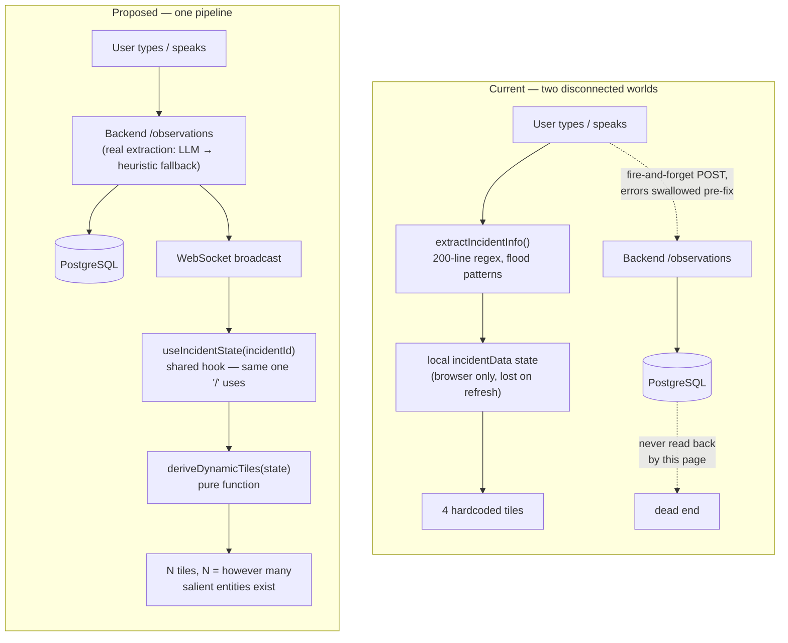
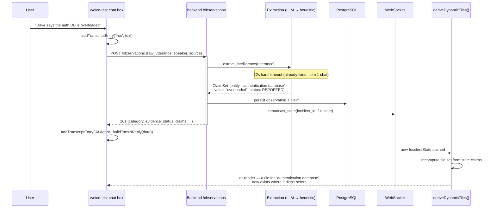
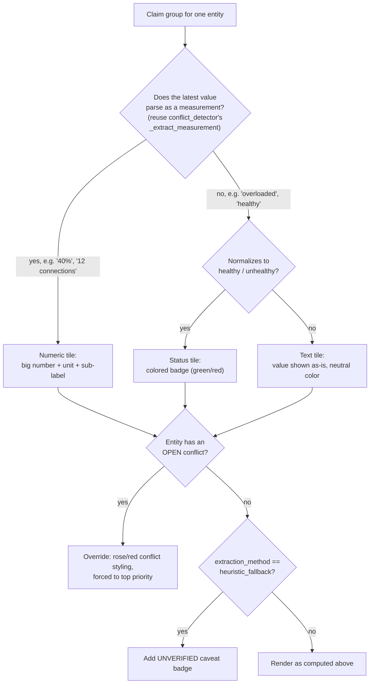
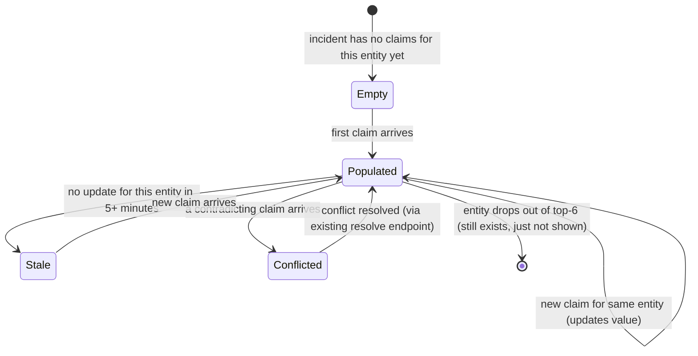

# `/voice-test` Dynamic Tiles — Rewire Plan

Status: **planning only, nothing in this doc has been implemented yet.** This is
`TODO.md` item 1, expanded into a full design. Do not start coding from this file
without re-reading `TODO.md` first in case its status line has moved.

Scope boundary set by `CLAUDE.md`: **the visual design of `/voice-test` must not
change.** Every fix below is a data-source swap underneath the existing light-theme UI
— same CSS classes (`vcc-metric-grid`, `vcc-metric-item`, `vcc-metric-label`,
`vcc-metric-value`, `vcc-metric-sub`, `vcc-inferred-note`, etc.), same layout, same
colors. Nothing here touches how the page looks; it only touches where its numbers
come from and how many tiles it decides to show.

---

## 1. What's actually broken (exact code, not paraphrase)

`frontend/src/app/voice-test/page.tsx` maintains its own local state, entirely
disconnected from the backend evidence engine:

```ts
metrics: {
  peopleAffected: string; peopleAffectedSub: string;
  waterLevel: string;     waterLevelSub: string;
  riskLevel: string;
  resourcesDeployed: string; resourcesSub: string;
}
```

Four fields, fixed forever, populated by `extractIncidentInfo()` — a ~200-line regex
function with flood/fire/earthquake/cyclone detection patterns left over from before
the identity-outage pivot. The JSX hardcodes English labels over these four flood-shaped
fields to make them read as identity-outage metrics:

```tsx
<div className="vcc-metric-label">Customers Affected</div>   {/* ← peopleAffected */}
<div className="vcc-metric-label">Gateway Error Rate</div>   {/* ← waterLevel      */}
<div className="vcc-metric-label">Risk Level</div>           {/* ← riskLevel       */}
<div className="vcc-metric-label">Service Health</div>       {/* ← resourcesDeployed */}
```

The label is a lie of convenience: the field underneath is still `waterLevel`, still
populated by flood-pattern regex, still capable of showing `"Rising rapidly"` under a
tile labeled "Gateway Error Rate" if the wrong phrase is spoken. This is a direct risk
against the project's own rule: *"Never show stale flood or payment labels in the
identity scenario."*

It is also disconnected from the real evidence engine entirely — none of this reads
`claims`, `conflicts`, `evidence_status`, or `extraction_method`. It cannot show a
contradiction. It cannot show that a value is UNVERIFIED. It cannot show anything about
an incident that isn't a flood, fire, earthquake, or cyclone, because those are the
only patterns `extractIncidentInfo` knows.

---

## 2. Design goals, in priority order

1. **One source of truth.** `/voice-test` must render the exact same `IncidentState`
   the `/` dashboard already gets from the backend — no second, parallel data model.
2. **Tiles are derived, not declared.** No component may hardcode "Customers Affected"
   or any other label. A tile's label, value, and existence are all computed from
   whatever claims actually exist for the current incident. A flood incident produces
   flood-shaped tiles; an identity outage produces identity-shaped tiles; an incident
   type nobody has thought of yet still produces *something* correct, because nothing
   is pattern-matched against a fixed disaster taxonomy.
3. **Fail-proof by explicit contract.** Every failure mode in §5 has one defined
   behavior, and that behavior is testable. No silent hangs, no fabricated data, no
   crash that takes out the whole panel.
4. **Zero visual change.** Same CSS, same layout, same light theme.
5. **No regression to what item-1's chat fix already proved works** — this reuses the
   same `/api/incidents/{id}/observations` pipeline and the same honesty conventions
   (evidence status visible, heuristic fallback flagged, never silently upgraded to
   CONFIRMED).

---

## 3. Architecture: before vs. after



The single most important line in that diagram: in the "after" state, `/voice-test`
and `/` call the **same hook**. Today they are two independent implementations of "get
the incident and keep it live" that can silently drift apart — this plan ends that.

---

## 4. Data flow, end to end



Two independent confirmations already arrive from one action: the chat reply (already
built, item 1 done) and the tile update (this plan). They must never diverge, because
they now read from the same POST response / WebSocket push.

---

## 5. Fail-proof requirements — one behavior per failure mode

This is the part "robust and fail-proof" actually means in code, not just as a phrase.
Each row is a requirement AND a test.

| Failure mode | Required behavior | How it's verified |
|---|---|---|
| Backend unreachable on page load | Show a skeleton/placeholder tile set with an explicit "Disconnected — showing last known state" banner. **Never** show fabricated zeros or blank tiles that look like real "no impact" data. | Unit test: `deriveDynamicTiles(null)` returns the placeholder shape, not `[]` or a throw. |
| WebSocket drops mid-session | Auto-reconnect with backoff (reuse `useIncidentWebSocket`'s existing reconnect logic — already built and tested for `/`). While reconnecting, tiles freeze at last-known values with a visible "reconnecting…" indicator, not a spinner-forever or a blank flash. | Live test: kill backend mid-session, confirm indicator appears, confirm tiles don't blank. |
| New incident, zero claims yet | Tiles show `—` / "Awaiting data" per-tile, exactly as the current placeholder styling already does — this part of the existing UI is correct and is preserved as-is. | Unit test on empty `claims: []`. |
| Extraction hit the heuristic fallback | Tile still renders, but carries a visible "UNVERIFIED" marker consistent with the rest of the app's evidence-status vocabulary (same convention as the chat reply's `⚠️ heuristic fallback` caveat). | Unit test: claim with `extraction_method: heuristic_fallback` renders with the caveat, never silently equal to an LLM-derived tile. |
| Malformed / unexpected claim shape (missing entity, null value, etc.) | `deriveDynamicTiles` skips that one claim and logs a diagnostic warning; it must never throw and take the whole panel down. Wrap the render itself in a React error boundary as a second layer. | Unit test with a deliberately malformed claim in the input array; confirm the other valid tiles still render. |
| More salient entities than tile slots (cap at 6, see §6) | Show the top 6 by priority, plus a "+N more — view full record" link into `IntelligencePanel`-equivalent detail (or, minimally, the existing transcript/claims list). No silent truncation without indicating there's more. | Unit test: 10 distinct entities in, exactly 6 tiles + overflow indicator out. |
| Rapid back-to-back WebSocket updates (e.g., several people talking at once) | Debounce re-render (150–250ms) so tiles don't flicker on every single claim; batch into the next paint. | Manual test: fire 5 updates within 200ms, confirm one re-render not five. |
| Two conflicting claims about the same entity | That entity's tile is the **highest priority** tile shown (never buried), styled with the same rose/red conflict treatment already used in `ConflictsPanel`, and links to the resolution flow already built. | Unit test: conflicted entity always sorts first regardless of recency. |

No row in this table is optional. If a row can't be satisfied cleanly, that's a reason
to flag it back before shipping, not to ship silently degraded.

---

## 6. The dynamic-tile algorithm

This is the actual design decision behind "tiles should modify themselves according to
the problem."

### 6.1 Selecting which entities become tiles

For the current incident's `claims` array:

1. **Group by entity** (case-insensitive, same normalization `conflict_detector.py`
   already uses via `_entities_match`).
2. **Compute a priority score per entity group:**
   - Conflicted (any claim in the group has `status: CONFLICTED`) → priority 0 (highest)
   - Overdue action item references this entity → priority 1
   - Confirmed fact exists for this entity → priority 2
   - Reported/unverified only → priority 3
   - Assumed only → priority 4
3. **Within a priority tier, sort by recency** (most recent claim timestamp first).
4. **Take the top 6** (`MAX_TILES = 6`, matching the current 2×2/2×3 grid capacity of
   the existing `vcc-metric-grid` CSS — no layout change needed). Remainder becomes the
   "+N more" overflow link from §5.

### 6.2 Deciding a tile's *shape*

Not every claim is a percentage. The current hardcoded tiles conflate two different
kinds of data (a health status like "overloaded" and a measurement like an error rate)
into the same visual slot. The dynamic version makes this explicit per-tile:



This reuses `_extract_measurement` and `normalize_value` from the backend's own
`conflict_detector.py` / `extraction.py` conventions (ported to a small TS equivalent,
or — better — computed server-side and included in the WebSocket payload so the
frontend never re-implements classification logic that already exists and is tested
in Python). **Decision to make at implementation time:** classify tile shape
server-side (adds a field to the claim/observation response) vs. client-side (duplicate
logic in TS). Recommend server-side — single implementation, already-tested regex/logic,
frontend just renders what it's told.

### 6.3 A tile's lifecycle



"Stale" is a new, small addition beyond what exists today: a tile whose entity hasn't
been mentioned in 5+ minutes gets a subtle dimmed treatment, distinguishing "this was
true a while ago" from "this is current." Cheap to add, meaningfully more honest.

---

## 7. Component / file plan

| Action | File | Notes |
|---|---|---|
| **Extract** | new `frontend/src/hooks/useIncidentState.ts` | Pull the incident-fetch + WebSocket-subscribe logic that currently lives inline in `page.tsx` (`/`) into a reusable hook. `/` switches to use it with **zero behavior change** — this step alone should be verifiable as a no-op via the existing dashboard tests before anything else changes. |
| **Add** | new `frontend/src/lib/deriveDynamicTiles.ts` | Pure function: `(state: IncidentState) => Tile[]`. No side effects, no fetch — trivially unit-testable per §5's table. This is where §6's algorithm lives. |
| **Add** | new `frontend/src/components/DynamicSituationTiles.tsx` | Renders `Tile[]` using the **existing** `vcc-metric-grid` / `vcc-metric-item` CSS classes already defined in `voice-test/page.tsx`'s `<style jsx>` block — visual output unchanged, source changed. Wrapped in a small error boundary per §5. |
| **Remove** | `extractIncidentInfo()` and the local `incidentData` metrics state in `voice-test/page.tsx` | ~200 lines deleted, including every flood/fire/earthquake/cyclone regex pattern. This is the actual fix to the CLAUDE.md risk in §1. |
| **Update** | `handleCommandSubmit`, the two voice-ingestion `stream-message` / `SpeechRecognition` handlers | Drop their calls to `extractIncidentInfo()` (item 1's chat-reply logic is untouched and already correct — this only removes the now-redundant local simulation call). |
| **Keep unchanged** | Every `vcc-*` CSS class, the Dynamic Island call UI, the transcript panel, the chat reply logic from item 1 | Explicitly out of scope — visual design freeze per `CLAUDE.md`. |

---

## 8. Testing plan

1. **Unit tests for `deriveDynamicTiles`** covering every row of §5's table, plus §6.1's
   priority ordering and §6.2's shape classification, as deterministic pure-function
   tests (no backend, no browser — fast, exhaustive).
2. **Unit tests for `useIncidentState`** reused from whatever coverage `/` already has,
   confirming the extraction was behavior-preserving.
3. **Live browser verification** (same method used to verify item 1's chat fix):
   - Fresh incident, zero claims → confirm placeholder tiles, no fabricated data.
   - Run the identity-outage demo scenario → confirm tiles reflect real entities
     (`authentication database`, `login api`, etc.), not flood labels.
   - Trigger a genuine conflict (two contradicting claims) → confirm the conflicted
     entity's tile appears with conflict styling at top priority.
   - Kill the backend mid-session → confirm the disconnected banner, no blank/fake data.
   - Resolve the conflict via the existing resolve endpoint → confirm the tile updates
     to reflect resolution without a page refresh.

Nothing in this plan is considered done until each of these has been run against the
live stack and screenshotted/logged, matching how item 1 was actually closed out —
not merely "tests pass."

---

## 9. Rollout sequencing

Do not attempt this as one large edit to a 2341-line file. Sequence:

1. Extract `useIncidentState` from `page.tsx` (`/`), point `/` at it, verify `/` is
   unchanged (existing dashboard tests + one live browser pass).
2. Write `deriveDynamicTiles` + its full unit test suite in isolation — no UI wiring
   yet. This is where most of the actual thinking happens and it's the cheapest part
   to get exhaustively right before touching the 2341-line file at all.
3. Add `DynamicSituationTiles` component, but render it **alongside** the old panel
   (both visible, or behind a `?debug_tiles=1` query param) — verify it produces
   sensible output against the real running backend without removing anything yet.
4. Swap the visible panel to the new component; delete `extractIncidentInfo()` and the
   old metrics state in the same change (don't leave dead code behind).
5. Full live verification per §8.
6. Update `TODO.md` (remove item 1, note completion) and `README.md`'s capability
   matrix.

---

## 10. Acceptance criteria

- [ ] `/voice-test` and `/` share one incident-state hook; no second implementation.
- [ ] Zero hardcoded tile labels or flood/fire/earthquake regex patterns remain in
      `voice-test/page.tsx`.
- [ ] Tile set genuinely changes shape based on which entities exist for the current
      incident — verified by running two different scenarios and confirming different
      tiles appear (not just different values in the same 4 fixed slots).
- [ ] Every row in §5's fail-proof table has a passing test.
- [ ] Visual output is unchanged for a human eyeballing it before/after (same CSS,
      same layout) — confirmed by comparing screenshots.
- [ ] `/voice-test` visual design constraint from `CLAUDE.md` was not violated at any
      point during implementation.
- [ ] Full backend + frontend test suites pass, `git diff --check` clean, live browser
      pass completed and reported with actual evidence (not claimed).
